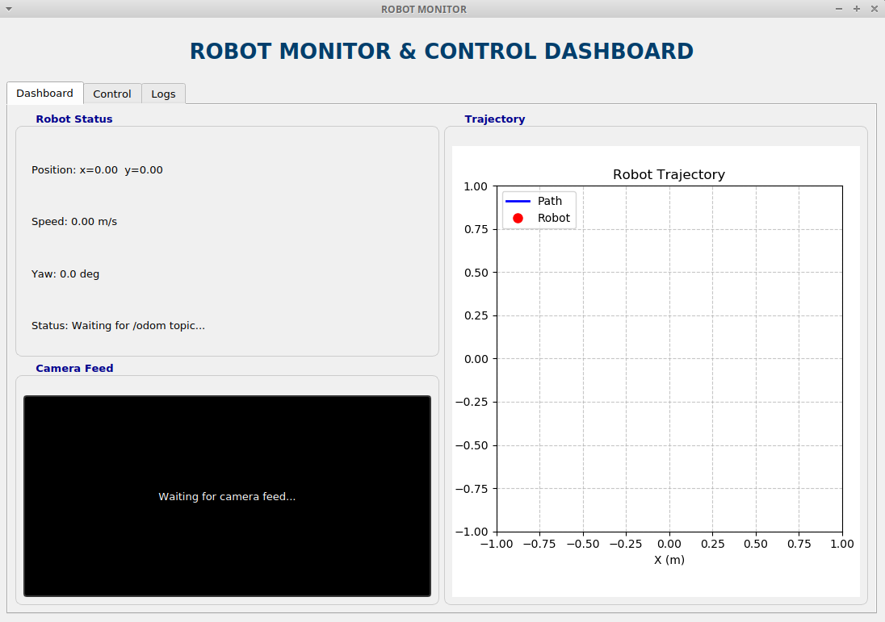
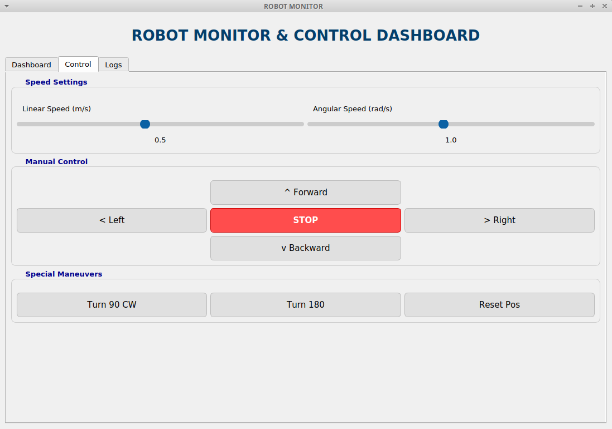
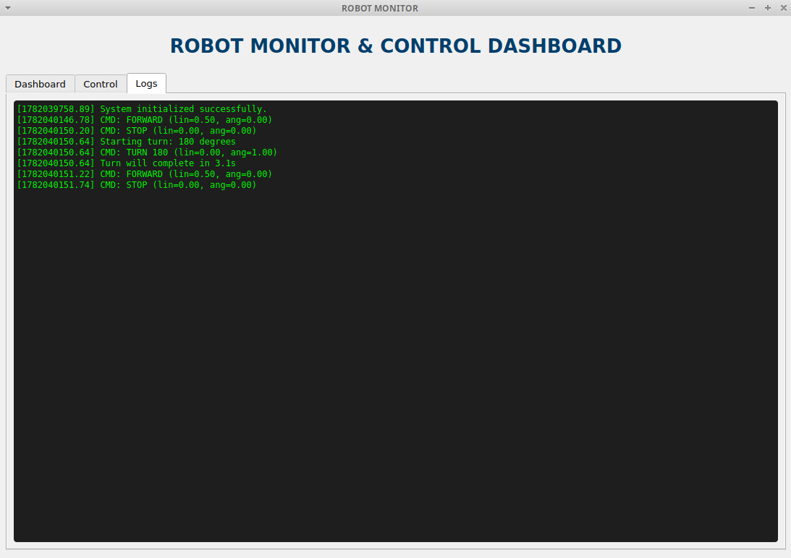

# Robot Monitor GUI for ROS

**Графический интерфейс оператора для мобильного робота на базе ROS Noetic и PyQt5.**

Данный проект представляет собой компонент программного пакета для мониторинга и управления мобильным роботом в среде симуляции Gazebo. Разработан в рамках дипломной работы по теме *"Создание компонентов графических элементов программного пакета фреймворка ROS"*.

## Основные возможности

- **Real-time Dashboard:** Отображение текущей позиции (X, Y), скорости и угла ориентации (Yaw) в реальном времени.
- **Визуализация траектории:** Построение пути движения робота с использованием Matplotlib. Реализована оптимизация рендеринга (deadband filter) для плавной отрисовки без мерцания.
- **Панель управления:** 
  - Ручное управление движением (вперед/назад/повороты).
  - Регулировка линейной и угловой скорости через ползунки.
  - Автоматические маневры: поворот на 90°/180° и сброс позиции (телепортация в Gazebo + сброс одометрии).
- **Видеопоток:** Интеграция камеры робота через CvBridge с конвертацией в QImage.
- **Система логирования:** Встроенная консоль событий с временными метками ROS для отладки и мониторинга команд.

## ️ Скриншоты интерфейса

### Dashboard

*Отображение телеметрии, видеопотока с камеры и графика траектории.*

### Control Panel

*Панель ручного управления, настройки скорости и специальные маневры.*

### Logs

*Журнал событий системы с фиксацией всех действий оператора.*

## ️ Требования

- **OS:** Ubuntu 20.04 LTS
- **ROS:** Noetic Ninjemys
- **Python:** 3.8+
- **Библиотеки:**
  ```bash
  pip install PyQt5 matplotlib numpy opencv-python
  sudo apt-get install ros-noetic-cv-bridge ros-noetic-sensor-msgs
